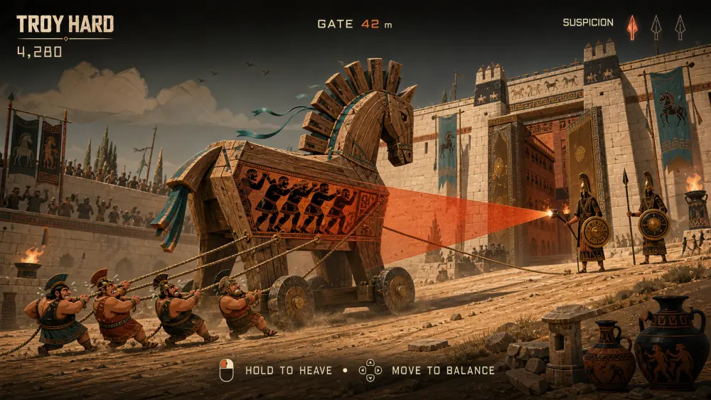

# TROY HARD

**A completely ordinary delivery.**

TROY HARD is a free 70–90 second physics-stealth browser game. The Trojans automatically haul a top-heavy wooden horse toward Troy; you keep the Greeks hidden inside balanced, braced, and silent during torch inspections.



Play target: [TROY HARD on Vercel](https://troy-hard-ayushhagarwals-projects.vercel.app/) · Case study: [/making-of/](https://troy-hard-ayushhagarwals-projects.vercel.app/making-of/) · Source: [GitHub](https://github.com/ayushhagarwal/troy-hard)

## Why this exists

The whole game is built around one physical joke: the Trojans enthusiastically deliver their own downfall while the player manages the hidden crew inside. The cart advances automatically. Holding braces the Greeks, while sliding shifts their weight to counter the road. Three escalating acts turn those two inputs into a short, replayable siege.

- No sign-in, installation, player database, ads, upgrades, or forced sharing.
- Practice, UTC daily, and same-seed friend challenge modes.
- Deterministic fixed-60 Hz simulation with render interpolation.
- Separate desktop and portrait compositions, keyboard/pointer/touch input, and accessibility settings.
- Local 1200×630 result cards plus native, X, copy, and download share paths.

## Stack and architecture

- Node 22, npm, React 19, TypeScript, and Vite 8
- Phaser 4.1 for the responsive rendered world
- Custom simulation for terrain, pitch, traction, rope tension, condition, suspicion, and inspections
- React for title, HUD, results, focus management, settings, sharing, and the case study
- Stateless Vercel challenge HTML and Open Graph image functions
- Local storage for preferences and personal bests only

```text
keyboard · pointer · touch
           ↓
   normalized InputFrame
           ↓
  fixed 60 Hz simulation ── seeded course + ruleset
           ↓
 interpolated Phaser world ── React HUD/results
           ↓
 bounded base36 duel token ── no database write
```

## Run locally

```bash
npm install
npm run dev
```

Open `http://127.0.0.1:5173`. Add `?test=1` on localhost to expose local-only deterministic inspection and result hooks used by browser QA.

```bash
npm run typecheck
npm test
npm run build
```

## Controls

- The Trojan pull team advances and stops automatically.
- Hold `Space`, `W`, `↑`, or the playfield to brace the hidden Greeks and suppress noise.
- Use `A`/`D`, `←`/`→`, or horizontal pointer movement to counterbalance the hidden crew.
- `R` retries immediately. `Esc`/`P` pauses.

Pointer cancel, tab blur, settings, and backgrounding safely release the controls and pause the simulation/audio.

## Routes

- `/` — title, daily siege, practice, and the game
- `/c/:token` — validated stateless duel shell
- `/making-of/` — visual and engineering case study
- `/credits/` — provenance, independence, privacy, and local-data controls
- `/api/og/:token` — cached 1200×630 challenge card

Challenge tokens are bounds-checked and include CRC32 for corruption detection. CRC32 is not represented as anti-cheat security; scores are friendly and self-reported.

## Creative provenance

The five accepted compositions in `docs/design/reference/` are the visual source of truth. Production environments, horse, pullers, inspector, and result scenes were created separately for this project, cleaned and reviewed locally, and tracked in [`docs/asset-provenance.md`](docs/asset-provenance.md). The adaptive soundtrack and effects are synthesized at runtime; no third-party recordings are shipped.

This is an independent work based on ancient mythology and is not affiliated with any modern film, studio, actor, publisher, or game franchise. See [`LICENSE.md`](LICENSE.md).
